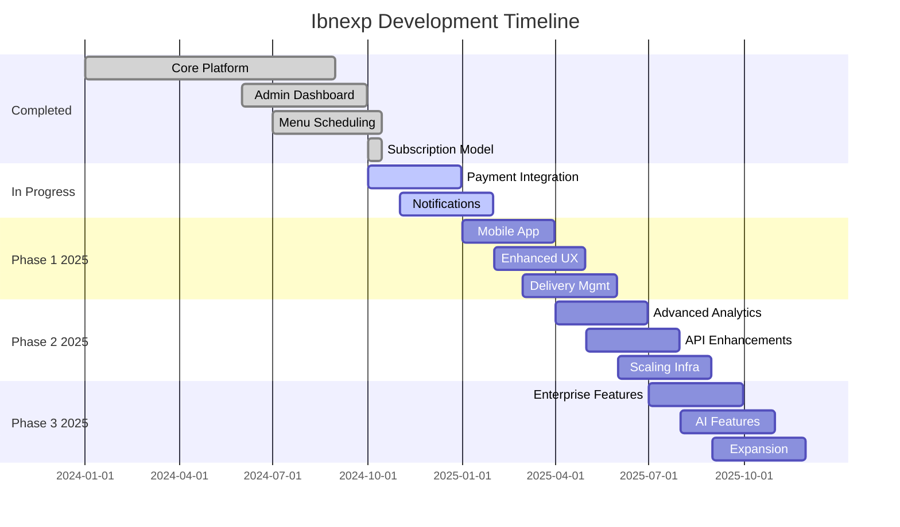

# Ibnexp Project Roadmap

## Project Status Overview

**Current Version**: 1.0.0 (Beta)  
**Last Updated**: October 2025  
**Overall Completion**: 70%  
**Current Phase**: Feature Enhancement & Stabilization

## Completed Features ✅

### Core Platform Features

#### User Management & Authentication
- [x] User registration system with email validation
- [x] Secure login/logout with JWT authentication
- [x] Role-based access control (Student/Admin)
- [x] Profile management with personal details
- [x] Student verification system
- [x] Password hashing with bcrypt

#### Meal Management
- [x] Complete meal catalog with images
- [x] Nutritional information display
- [x] Ingredient list for each meal
- [x] Bilingual meal descriptions (English/Arabic)
- [x] Meal categorization and filtering
- [x] Image upload and storage system
- [x] Meal status management (active/inactive)

#### Subscription System
- [x] Multiple subscription plans (FUEL, FOCUS, FLEX)
- [x] Flexible pricing with student discounts
- [x] Enhanced subscription lifecycle management with 7 distinct states
- [x] Payment tracking and history
- [x] Automatic renewal options with business rule validation
- [x] Subscription status tracking with state history
- [x] State transition system with validation and audit trails
- [x] Admin controls for subscription state management
- [x] Bulk operations for subscription state changes

#### Admin Dashboard
- [x] Comprehensive admin panel
- [x] Enhanced user management interface with subscription controls
- [x] Real-time dashboard statistics with subscription metrics
- [x] Daily orders reporting
- [x] Financial overview and metrics
- [x] Advanced subscription management tools
- [x] Meal and plan CRUD operations
- [x] Subscription state transition interface
- [x] State history tracking and visualization

#### Menu Scheduling
- [x] Dynamic menu scheduling system
- [x] Calendar-based meal planning
- [x] Plan-specific menu assignments
- [x] Lunch/Dinner slot management
- [x] Menu cycle creation and management
- [x] Bulk scheduling capabilities

#### Technical Infrastructure
- [x] RESTful API architecture
- [x] SQLite database with migrations
- [x] Angular frontend with TypeScript
- [x] Node.js/Express backend
- [x] Responsive design with Tailwind CSS
- [x] Bilingual support (English/Arabic)
- [x] Image serving and optimization
- [x] Error handling and logging
- [x] Input validation and sanitization

### Quality Assurance
- [x] Database schema design with subscription state history
- [x] API endpoint testing including state transitions
- [x] Frontend component testing
- [x] Cross-browser compatibility
- [x] Mobile responsiveness
- [x] Security vulnerability assessment
- [x] Subscription state transition validation testing
- [x] Data migration testing and verification

## In Progress Features 🔄

### Payment Integration
- [ ] Stripe payment gateway integration
- [ ] Apple Pay and Google Pay support
- [ ] Automatic payment processing with state transitions
- [ ] Invoice generation
- [ ] Refund management system
- [ ] Payment failure handling with subscription state updates

### Notification System
- [ ] Email notification service
- [ ] SMS notifications for deliveries
- [ ] Push notifications for mobile
- [ ] Subscription renewal reminders
- [ ] Delivery status updates
- [ ] Marketing communications

### Enhanced Admin Features
- [x] Advanced subscription state management dashboard
- [x] Customer lifecycle tracking through subscription states
- [x] Revenue forecasting with subscription state metrics
- [ ] Advanced analytics dashboard
- [ ] Customer behavior tracking
- [ ] Inventory management system
- [ ] Supplier management
- [ ] Cost analysis reports

## Upcoming Features 📋

### Phase 1: Q4 2025 (High Priority)

#### Mobile Application
- [ ] React Native mobile app
- [ ] Push notification support
- [ ] Offline mode capabilities
- [ ] Mobile-specific UI/UX
- [ ] Biometric authentication
- [ ] Location-based delivery tracking

#### Enhanced User Experience
- [ ] Personalized meal recommendations
- [ ] Dietary preference filtering
- [ ] Allergy management system
- [ ] Custom meal planning
- [ ] Social features (meal sharing)
- [ ] Rating and review system

#### Delivery Management
- [ ] Real-time delivery tracking
- [ ] Delivery driver app
- [ ] Route optimization
- [ ] Delivery time windows
- [ ] Customer delivery preferences
- [ ] Delivery confirmation system

### Phase 2: Q1 2026 (Medium Priority)

#### Advanced Analytics
- [ ] Business intelligence dashboard
- [ ] Predictive analytics for demand
- [ ] Customer segmentation
- [ ] A/B testing framework
- [ ] Performance metrics tracking
- [ ] Custom report generation

#### API Enhancements
- [ ] GraphQL API implementation
- [ ] API rate limiting
- [ ] Webhook system
- [ ] Third-party integrations
- [ ] API documentation portal
- [ ] SDK for developers

#### Scaling Infrastructure
- [ ] Microservices architecture migration
- [ ] PostgreSQL database migration
- [ ] Redis caching implementation
- [ ] CDN integration
- [ ] Load balancing setup
- [ ] Container orchestration

### Phase 3: Q2 2026 (Future Enhancements)

#### Enterprise Features
- [ ] Multi-tenant support
- [ ] White-label solutions
- [ ] Corporate meal plans
- [ ] Bulk ordering system
- [ ] Invoice management
- [ ] Contract management

#### AI-Powered Features
- [ ] AI meal recommendations
- [ ] Demand prediction algorithms
- [ ] Automated menu planning
- [ ] Chatbot customer support
- [ ] Image recognition for meals
- [ ] Nutritional analysis

#### Expansion Features
- [ ] Multi-city support
- [ ] Multiple cuisine options
- [ ] Catering services
- [ ] Event ordering
- [ ] Gift subscription system
- [ ] Loyalty program

## Technical Debt & Improvements 🔧

### Code Quality
- [ ] Comprehensive unit test coverage (>90%)
- [ ] Integration test suite
- [ ] E2E testing automation
- [ ] Code refactoring for legacy components
- [ ] Performance optimization
- [ ] Security audit and hardening

### Documentation
- [ ] API documentation with OpenAPI/Swagger
- [ ] Developer onboarding guide
- [ ] Deployment documentation
- [ ] Troubleshooting guides
- [ ] Best practices documentation
- [ ] Architecture decision records

### DevOps & Infrastructure
- [ ] CI/CD pipeline implementation
- [ ] Automated testing in pipeline
- [ ] Infrastructure as code (Terraform)
- [ ] Monitoring and alerting setup
- [ ] Backup and disaster recovery
- [ ] Security scanning automation

## Timeline Summary

## Resource Allocation

### Current Team Structure
- **Backend Developer**: 1 (Full-time)
- **Frontend Developer**: 1 (Full-time)
- **UI/UX Designer**: 1 (Part-time)
- **DevOps Engineer**: 1 (Part-time)
- **Project Manager**: 1 (Part-time)

### Planned Team Expansion
- **Mobile Developer**: Q1 2025
- **Data Scientist**: Q2 2025
- **QA Engineer**: Q1 2025
- **Customer Support**: Q4 2025

## Risk Assessment & Mitigation

### Technical Risks
1. **Database Performance**
   - Risk: SQLite limitations at scale
   - Mitigation: Plan PostgreSQL migration

2. **Security Vulnerabilities**
   - Risk: Payment processing security
   - Mitigation: PCI compliance, regular audits

3. **Scalability Issues**
   - Risk: Performance bottlenecks
   - Mitigation: Microservices architecture

### Business Risks
1. **Market Competition**
   - Risk: Competitor features
   - Mitigation: Continuous innovation

2. **User Adoption**
   - Risk: Low user engagement
   - Mitigation: User feedback loops

3. **Regulatory Compliance**
   - Risk: Food safety regulations
   - Mitigation: Compliance monitoring

## Success Metrics

### Technical KPIs
- API response time < 200ms
- 99.9% uptime
- 90%+ test coverage
- Zero security vulnerabilities

### Business KPIs
- User registration rate
- Subscription conversion rate
- Customer retention rate
- Monthly active users
- Revenue per user

### User Experience KPIs
- User satisfaction score > 4.5/5
- App store rating > 4.0
- Support ticket resolution time < 24h
- Feature adoption rate

## Dependencies & Blockers

### External Dependencies
- Payment gateway provider approval
- App store review processes
- Third-party API integrations
- Supplier partnerships

### Internal Dependencies
- Database migration completion
- Team hiring and training
- Infrastructure provisioning
- Security certification

## Next Steps

### Immediate Actions (Next 30 Days)
1. Complete payment integration testing with subscription state transitions
2. Deploy notification system beta
3. Begin mobile app development
4. Hire QA engineer
5. Set up CI/CD pipeline
6. Monitor subscription state transitions in production
7. Gather feedback on new subscription model from users

### Short-term Goals (Next 90 Days)
1. Launch mobile app MVP
2. Implement enhanced analytics
3. Complete API documentation
4. Achieve 90% test coverage
5. Optimize performance bottlenecks

### Long-term Vision (6-12 Months)
1. Expand to multiple cities
2. Launch enterprise features
3. Implement AI-powered features
4. Achieve 10,000 active users
5. Establish partnership network

---

**Last Updated**: October 15, 2025  
**Next Review Date**: November 15, 2025  
**Document Owner**: Project Manager  
**Approval Status**: Draft