# System Architecture Documentation

## Overview

The Ibnexp meal subscription system follows a modern full-stack architecture with clear separation of concerns between frontend, backend, and database layers. This document provides a comprehensive overview of the system's technical architecture, data flow, and component relationships.

## High-Level Architecture

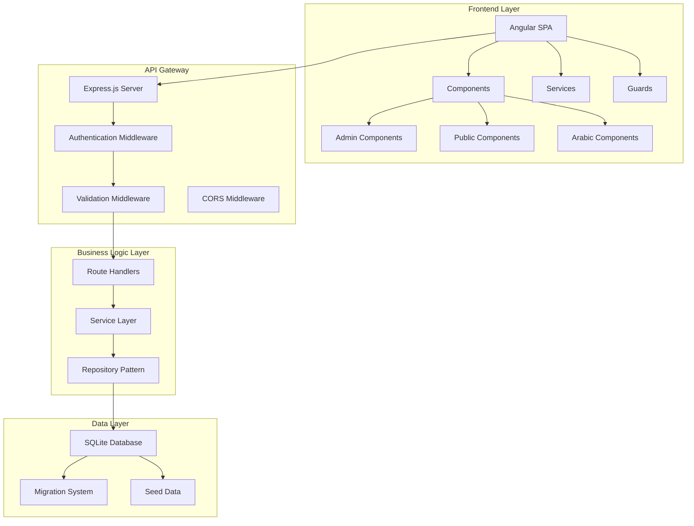

## Frontend Architecture

### Component Hierarchy

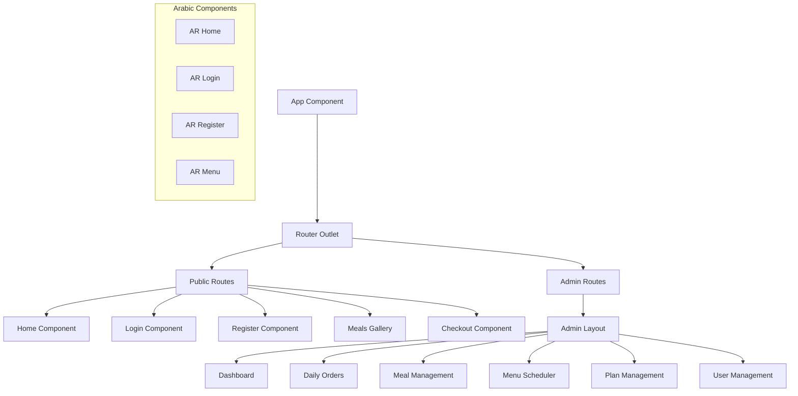

### Angular Services Architecture

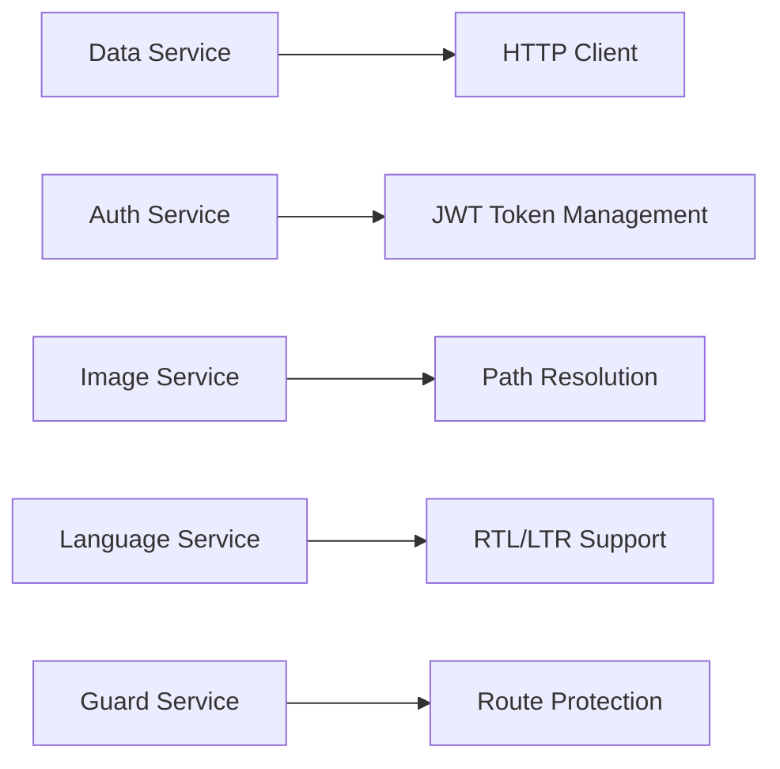

## Backend Architecture

### API Route Structure

```mermaid
graph TD
    A[Express App] --> B[/api Routes]
    B --> C[/auth]
    B --> D[/meals]
    B --> E[/plans]
    B --> F[/subscriptions]
    B --> G[/users]
    B --> H[/ingredients]
    B --> I[/admin]
    
    C --> C1[POST /register]
    C --> C2[POST /login]
    C --> C3[GET /me]
    C --> C4[POST /logout]
    
    D --> D1[GET /]
    D --> D2[GET /:id]
    D --> D3[POST /]
    D --> D4[PUT /:id]
    D --> D5[DELETE /:id]
    
    I --> I1[GET /dashboard]
    I --> I2[GET /daily-orders]
    I --> I3[GET /subscriptions]
    I --> I4[POST /menu-schedule]
```

### Middleware Stack

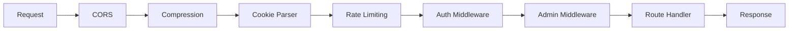

### Service Layer Architecture

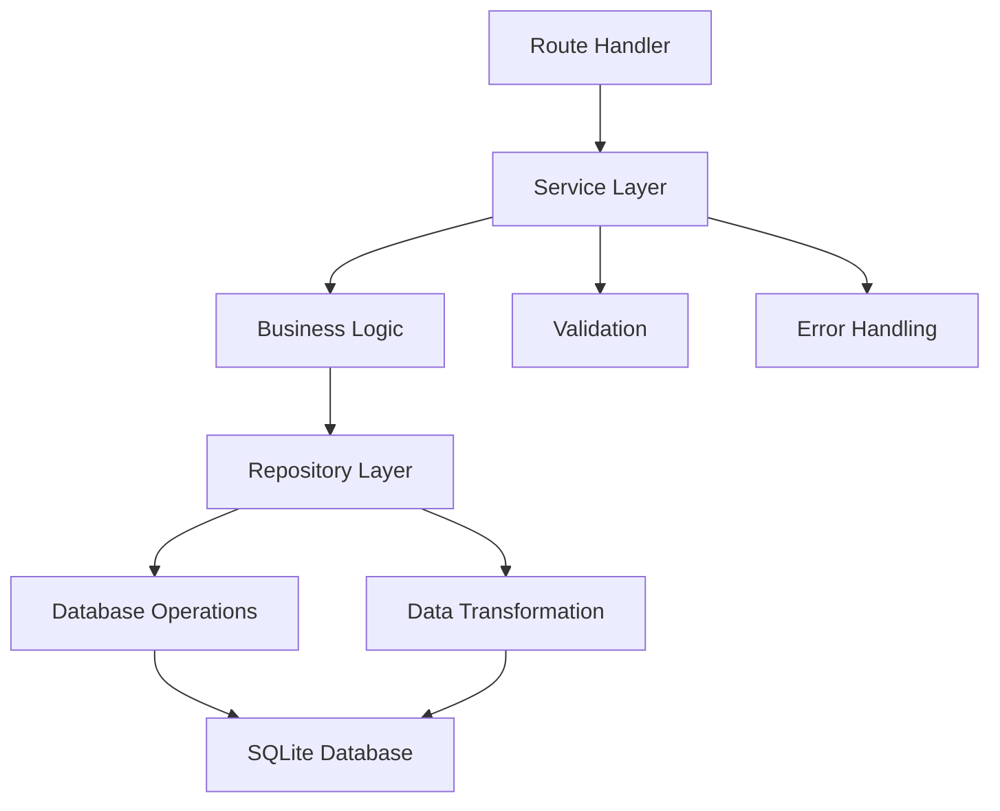

## Database Architecture

### Schema Overview

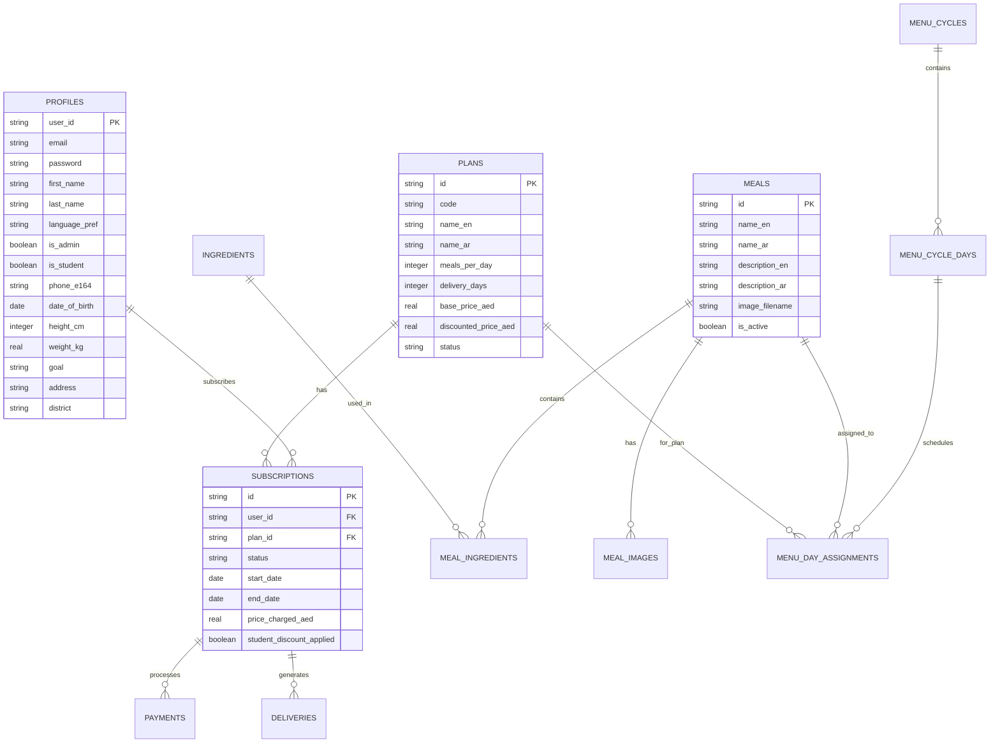

### Database Relationships

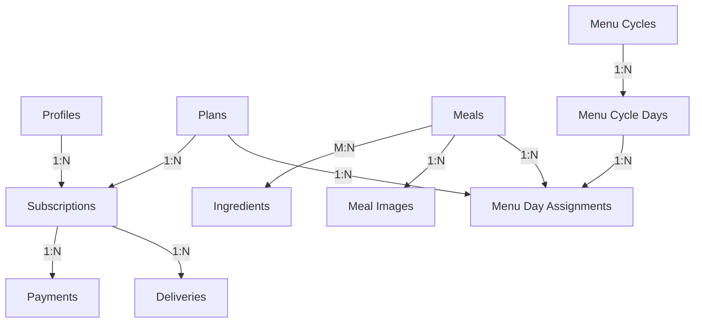

## Data Flow Architecture

### Authentication Flow

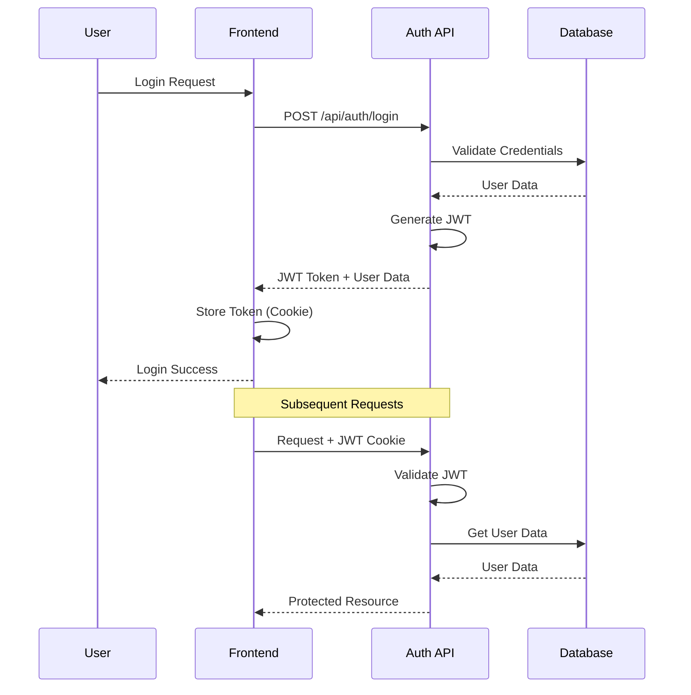

### Meal Management Flow

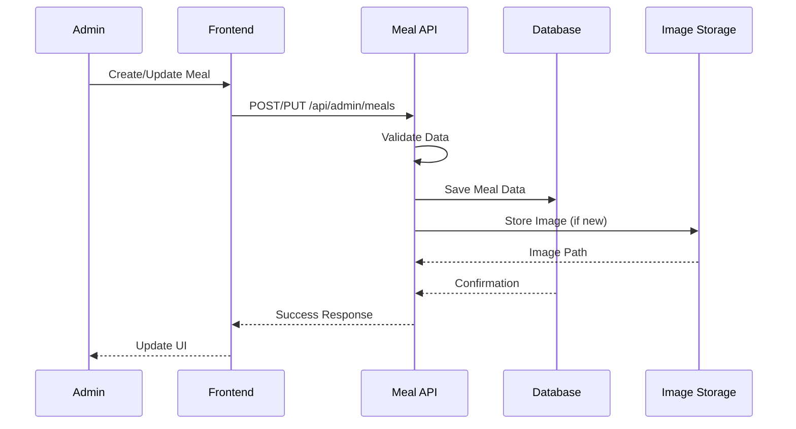

### Subscription Flow

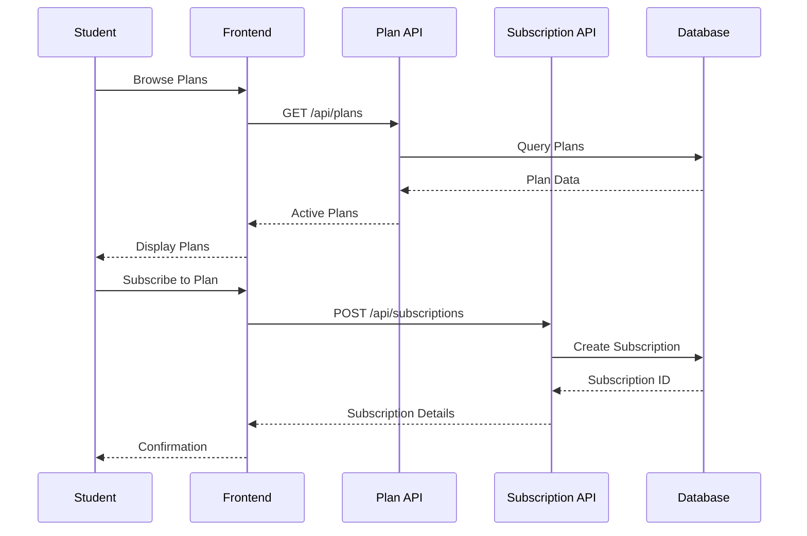

## Security Architecture

### Authentication & Authorization

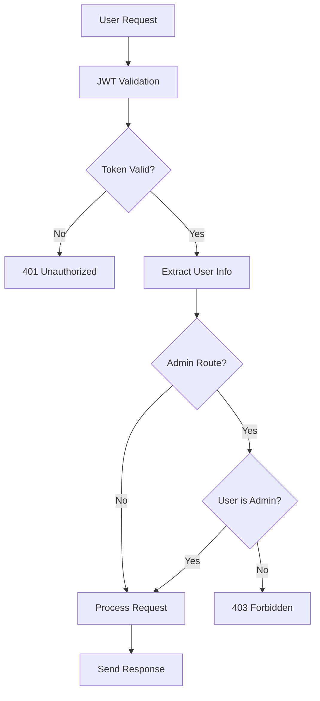

### Data Validation

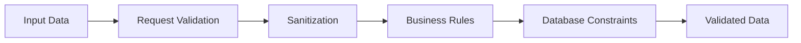

## Performance Considerations

### Caching Strategy

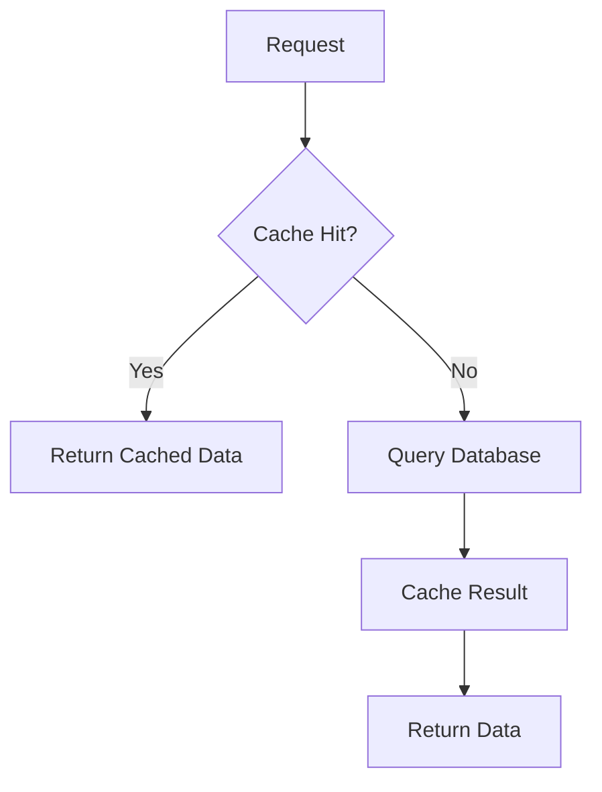

### Database Optimization

- Indexes on frequently queried columns
- Foreign key constraints for data integrity
- Connection pooling for performance
- Prepared statements for security

## Deployment Architecture

### Development Environment

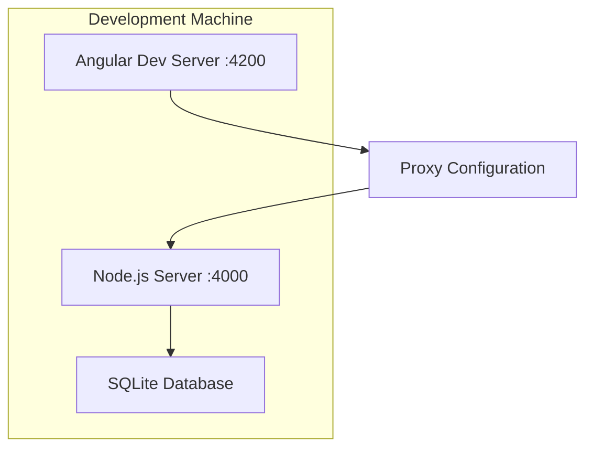

### Production Architecture (Recommended)

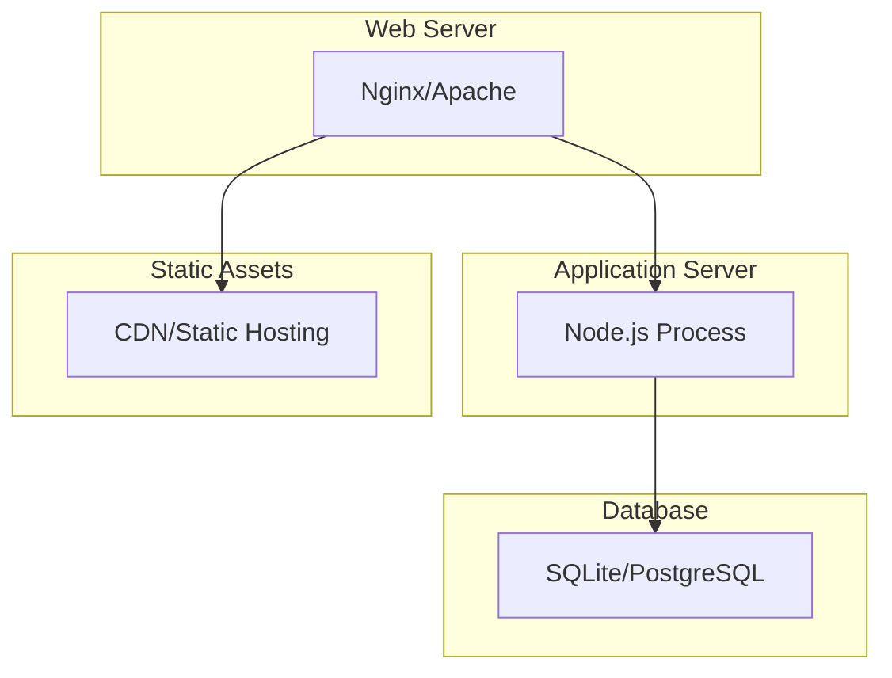

## Technology Stack Details

### Frontend Dependencies
- **Angular 20.3.0**: Modern reactive framework
- **TypeScript 5.8**: Type-safe JavaScript
- **Tailwind CSS**: Utility-first CSS framework
- **RxJS**: Reactive programming library

### Backend Dependencies
- **Express.js 4.18**: Web application framework
- **better-sqlite3 9.2**: SQLite database driver
- **jsonwebtoken 9.0**: JWT implementation
- **bcryptjs 2.4**: Password hashing
- **joi 17.11**: Data validation

### Development Tools
- **Vite**: Fast build tool
- **tsx**: TypeScript execution
- **ESLint**: Code linting
- **Prettier**: Code formatting

## Error Handling Strategy

### Frontend Error Handling

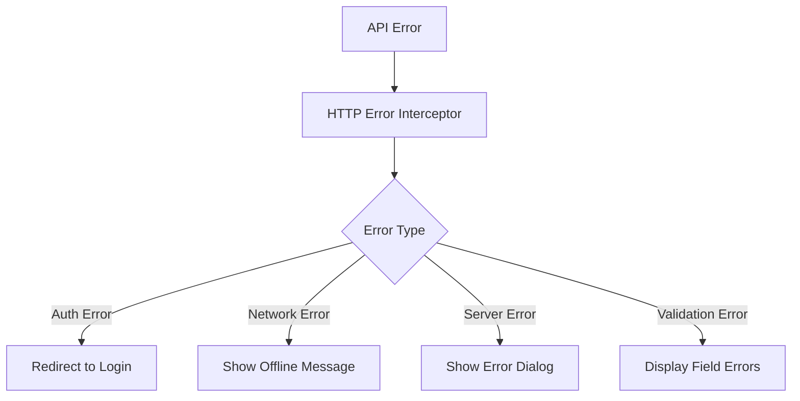

### Backend Error Handling

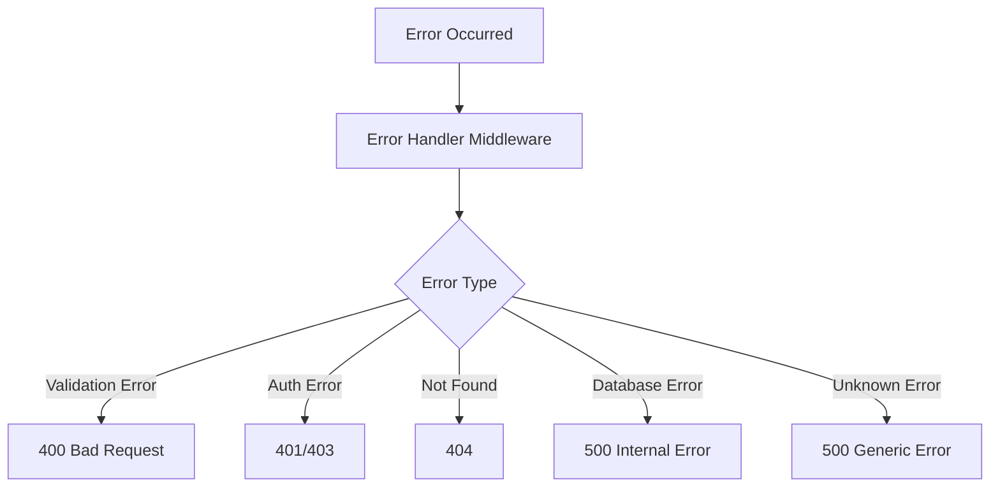

## Monitoring and Logging

### Logging Strategy
- Request/response logging
- Error tracking
- Performance metrics
- Database query logging
- Authentication events

### Monitoring Points
- API response times
- Database query performance
- Error rates
- User activity patterns
- Resource utilization

## Scalability Considerations

### Horizontal Scaling
- Stateless API design
- Database connection pooling
- Session-less authentication (JWT)
- Load balancer compatibility

### Vertical Scaling
- Memory optimization
- CPU utilization monitoring
- Database indexing strategy
- Caching implementation

## Future Architecture Enhancements

### Planned Improvements
1. **Microservices Migration**: Split monolithic backend into services
2. **Event-Driven Architecture**: Implement message queues for async operations
3. **API Gateway**: Centralized API management
4. **Container Orchestration**: Docker/Kubernetes deployment
5. **Read Replicas**: Database read scaling
6. **CDN Integration**: Global content delivery

### Technology Migration Path
- SQLite → PostgreSQL for production
- JWT → OAuth 2.0 for third-party integration
- REST → GraphQL for efficient data fetching
- Angular → PWA for offline capabilities