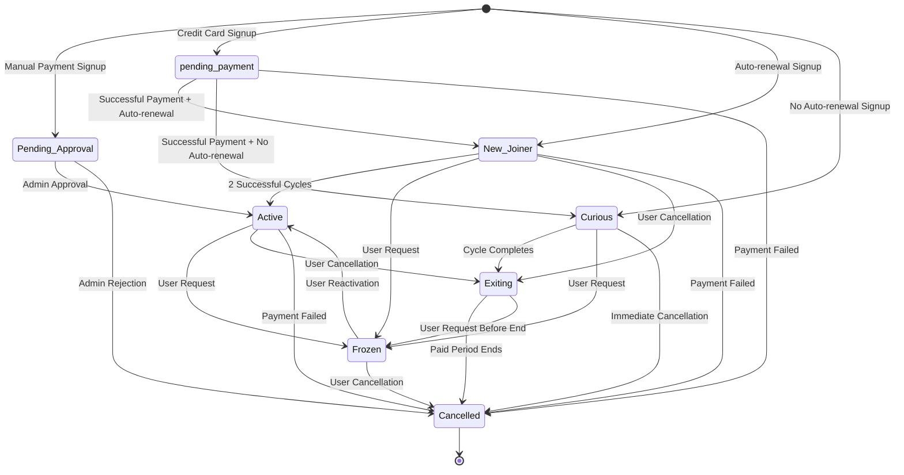

# Enhanced Subscription Data Model Design

## Overview

This document outlines the enhanced subscription data model that expands the current simplistic status system to better capture the business logic of the customer lifecycle.

## Current Model Analysis

### Current Subscription States
- `pending_payment`: Waiting for payment confirmation
- `active`: Active subscription with deliveries
- `paused`: Subscription temporarily paused
- `cancelled`: Subscription cancelled
- `expired`: Subscription period ended

### Current Limitations
1. No distinction between payment methods (credit card vs manual approval)
2. No tracking of subscription lifecycle stages (trial vs established customer)
3. No audit trail for state changes
4. Limited support for auto-renewal logic
5. No cycle counting for transition rules

## Enhanced Subscription Model

### New Subscription States

1. **Pending_Approval**: Signed up not through credit card (requires manual approval)
   - Trigger: User signs up with wire transfer or other manual payment method
   - Business Rule: Requires admin approval before becoming active
   - Delivery Status: No deliveries until approved

2. **Curious**: Subscribed for one cycle and asked from start not to auto-renew (trying us out)
   - Trigger: User explicitly opts out of auto-renewal at signup
   - Business Rule: Service rendered for paid cycle, then automatically moves to Exiting
   - Delivery Status: Normal deliveries during cycle

3. **New_Joiner**: Asked to auto-renew and after two cycles of successful payment becomes Active
   - Trigger: User signs up with auto-renewal enabled
   - Business Rule: Must complete 2 successful payment cycles to become Active
   - Delivery Status: Normal deliveries during cycles

4. **Frozen**: Asked to put account on hold (no delivery or payments until reactivating)
   - Trigger: User requests account hold
   - Business Rule: No deliveries, no payments, can be reactivated
   - Delivery Status: All deliveries suspended

5. **Exiting**: Submitted cancellation and service rendered till the paid cycle ends
   - Trigger: User cancels subscription or Curious cycle completes
   - Business Rule: Continue service until end of paid period
   - Delivery Status: Continue deliveries until end date

6. **Active**: Established customer with successful payment history
   - Trigger: New_Joiner completes 2 cycles, or direct activation
   - Business Rule: Normal subscription operation
   - Delivery Status: Normal deliveries

7. **Cancelled**: No liabilities and no activity
   - Trigger: Exiting period ends or immediate cancellation
   - Business Rule: No service, no payments
   - Delivery Status: No deliveries

### State Transition Diagram



## Database Schema Changes

### Enhanced Subscriptions Table

```sql
-- Add new columns to subscriptions table
ALTER TABLE subscriptions ADD COLUMN payment_method TEXT NOT NULL DEFAULT 'credit_card' CHECK (payment_method IN ('credit_card', 'wire_transfer', 'other'));
ALTER TABLE subscriptions ADD COLUMN auto_renewal INTEGER NOT NULL DEFAULT 1 CHECK (auto_renewal IN (0, 1));
ALTER TABLE subscriptions ADD COLUMN completed_cycles INTEGER NOT NULL DEFAULT 0;
ALTER TABLE subscriptions ADD COLUMN notes TEXT;

-- Update status check constraint to include new states
-- Note: This will be done in migration with proper data preservation
```

### New Subscription State History Table

```sql
CREATE TABLE subscription_state_history (
    id TEXT PRIMARY KEY,
    subscription_id TEXT NOT NULL,
    previous_state TEXT,
    new_state TEXT NOT NULL,
    reason TEXT,
    changed_by TEXT, -- user_id or 'system'
    created_at DATETIME NOT NULL DEFAULT CURRENT_TIMESTAMP,
    FOREIGN KEY (subscription_id) REFERENCES subscriptions(id) ON DELETE CASCADE
);

CREATE INDEX idx_subscription_state_history_subscription_id ON subscription_state_history(subscription_id);
CREATE INDEX idx_subscription_state_history_created_at ON subscription_state_history(created_at);
```

## Business Rules Implementation

### State Transition Validation Rules

1. **Pending_Approval → Active**: Only allowed by admin users
2. **New_Joiner → Active**: Only after completed_cycles >= 2
3. **Active → Frozen**: User request only
4. **Frozen → Active**: User reactivation only
5. **Exiting → Cancelled**: Only after end_date reached
6. **Any State → Cancelled**: Payment failure or admin action

### Cycle Counting Logic

- Increment `completed_cycles` when payment is successful
- Reset to 0 when subscription is reactivated from Frozen
- Track separately for each subscription period

### Auto-renewal Logic

- Check `auto_renewal` flag before processing renewals
- Curious subscriptions never auto-renew
- New_Joiner and Active subscriptions auto-renew based on flag

## Data Migration Strategy

### Current State Mapping

| Current State | New State | Conditions |
|---------------|-----------|------------|
| pending_payment | pending_payment | If payment_method = 'credit_card' |
| pending_payment | Pending_Approval | If payment_method != 'credit_card' |
| active | Active | If completed_cycles >= 2 |
| active | New_Joiner | If completed_cycles < 2 and auto_renewal = 1 |
| active | Curious | If auto_renewal = 0 |
| paused | Frozen | Direct mapping |
| cancelled | Cancelled | Direct mapping |
| expired | Cancelled | Direct mapping |

### Migration Steps

1. Add new columns to subscriptions table
2. Create subscription_state_history table
3. Backfill data based on current state and payment history
4. Update status constraints
5. Create initial state history records for existing subscriptions

## Backend Implementation

### New TypeScript Interfaces

```typescript
export type SubscriptionStatus = 
  | 'pending_payment' 
  | 'Pending_Approval' 
  | 'New_Joiner' 
  | 'Curious' 
  | 'Active' 
  | 'Frozen' 
  | 'Exiting' 
  | 'Cancelled';

export type PaymentMethod = 'credit_card' | 'wire_transfer' | 'other';

export interface Subscription {
  id: string;
  user_id: string;
  plan_id: string;
  status: SubscriptionStatus;
  start_date: string;
  end_date: string;
  student_discount_applied: boolean;
  price_charged_aed: number;
  currency: string;
  created_at: string;
  updated_at: string;
  renewal_type: string;
  has_successful_payment: boolean;
  // New fields
  payment_method: PaymentMethod;
  auto_renewal: boolean;
  completed_cycles: number;
  notes?: string;
}

export interface SubscriptionStateHistory {
  id: string;
  subscription_id: string;
  previous_state?: SubscriptionStatus;
  new_state: SubscriptionStatus;
  reason?: string;
  changed_by: string;
  created_at: string;
}
```

### Enhanced Repository Methods

```typescript
class SubscriptionRepository extends BaseRepository<Subscription> {
  // Existing methods...
  
  // New methods for state management
  transitionState(subscriptionId: string, newState: SubscriptionStatus, reason?: string, changedBy?: string): boolean;
  getStateHistory(subscriptionId: string): SubscriptionStateHistory[];
  findByPaymentMethod(method: PaymentMethod): Subscription[];
  findNewJoinersReadyForActivation(): Subscription[];
  findExitingSubscriptionsReadyToCancel(): Subscription[];
  incrementCompletedCycles(subscriptionId: string): boolean;
}
```

### State Transition Service

```typescript
class SubscriptionStateService {
  validateTransition(currentState: SubscriptionStatus, newState: SubscriptionStatus): boolean;
  executeTransition(subscriptionId: string, newState: SubscriptionStatus, reason?: string, changedBy?: string): boolean;
  processPaymentSuccess(subscriptionId: string): boolean;
  processPaymentFailure(subscriptionId: string): boolean;
  checkAndActivateNewJoiners(): number;
  checkAndCancelExitingSubscriptions(): number;
}
```

## Frontend Updates

### Updated TypeScript Interface

```typescript
export interface Subscription {
  id: string;
  userId: string;
  user: User;
  planId: string;
  planName: string;
  planPrice: number;
  startDate: string;
  endDate?: string;
  status: SubscriptionStatus;
  deliveryAddress: {
    street: string;
    city: string;
    district: string;
  };
  paymentMethod: PaymentMethod;
  autoRenewal: boolean;
  completedCycles: number;
  notes?: string;
  paymentProof?: string;
}
```

### UI Components to Update

1. Admin Dashboard - Subscription status breakdown
2. User Management - Status display and state change controls
3. Subscription Details - Enhanced status information
4. Subscription Creation - Payment method and auto-renewal options

## Testing Strategy

### Unit Tests
- State transition validation
- Business rule enforcement
- Cycle counting logic
- Auto-renewal processing

### Integration Tests
- End-to-end state transitions
- Payment processing with state changes
- Admin approval workflows

### Data Migration Tests
- Verify current data preservation
- Test state mapping accuracy
- Validate history record creation

## Implementation Timeline

1. **Phase 1**: Database schema and migration (Days 1-2)
2. **Phase 2**: Backend model and repository updates (Days 3-4)
3. **Phase 3**: State transition service implementation (Days 5-6)
4. **Phase 4**: API endpoint updates (Days 7-8)
5. **Phase 5**: Frontend interface updates (Days 9-10)
6. **Phase 6**: Testing and documentation (Days 11-12)

## Rollback Plan

1. Database backup before migration
2. Revert migration script available
3. Feature flags to disable new functionality
4. Monitoring for state transition errors