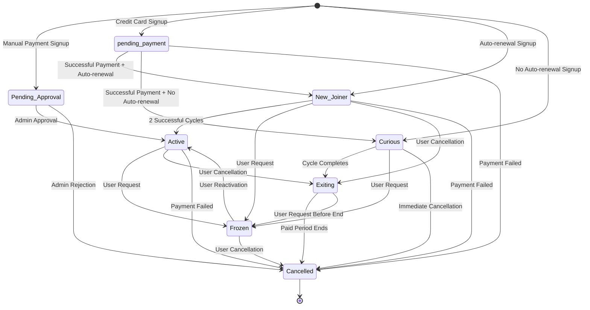

# Subscription Lifecycle Overview

## Introduction

This document provides a comprehensive overview of the enhanced subscription lifecycle management system implemented in the IbnExp2 meal subscription application. The new system features 7 distinct subscription states that accurately capture the customer journey from initial signup to cancellation, with proper business rules and state transitions.

## Subscription States

### 1. Pending_Approval
**Description**: Customers who sign up using manual payment methods (wire transfer, cash, etc.) and require admin approval before activation.

**Business Rules**:
- No deliveries are provided until approved
- No payments are processed until approved
- Admin can approve or reject the subscription
- Automatically created when payment_method != 'credit_card'

**Valid Transitions**:
- → **Active**: Admin approval (manual payment confirmed)
- → **cancelled**: Admin rejection or customer cancellation

**Use Cases**:
- Corporate accounts requiring invoice-based billing
- Customers preferring bank transfers
- Special payment arrangements

### 2. Curious
**Description**: Trial customers who subscribe for a single cycle without auto-renewal to test the service.

**Business Rules**:
- Normal deliveries during the paid cycle
- No automatic renewal at cycle end
- Automatically transitions to Exiting when cycle ends
- Created when auto_renewal = false

**Valid Transitions**:
- → **Exiting**: Cycle completion (automatic)
- → **Frozen**: Customer request (manual)
- → **cancelled**: Immediate cancellation (manual)

**Use Cases**:
- First-time customers trying the service
- Short-term subscribers (vacation, special events)
- Price-sensitive customers testing the service

### 3. New_Joiner
**Description**: New customers with auto-renewal who are establishing their payment history.

**Business Rules**:
- Normal deliveries during subscription
- Auto-renewal enabled
- Becomes Active after 2 successful payment cycles
- Created when auto_renewal = true and payment_method = 'credit_card'

**Valid Transitions**:
- → **Active**: After 2 successful payment cycles (automatic)
- → **Frozen**: Customer request (manual)
- → **Exiting**: Customer cancellation (manual)
- → **cancelled**: Payment failure (automatic)

**Use Cases**:
- New customers committing to long-term service
- Customers preferring automatic payments
- Standard subscription onboarding

### 4. Active
**Description**: Established customers with successful payment history and full service benefits.

**Business Rules**:
- Full service benefits and deliveries
- Auto-renewal based on customer preference
- Priority customer support
- Stable revenue stream

**Valid Transitions**:
- → **Frozen**: Customer request (manual)
- → **Exiting**: Customer cancellation (manual)
- → **cancelled**: Payment failure (automatic)

**Use Cases**:
- Long-term customers with proven payment history
- High-value customers with special privileges
- Stable customer base

### 5. Frozen
**Description**: Temporarily suspended accounts with no deliveries or payments.

**Business Rules**:
- No deliveries during frozen period
- No payments processed during frozen period
- Can be reactivated to previous state
- Maintains subscription history and preferences

**Valid Transitions**:
- → **Active**: Customer reactivation (manual)
- → **cancelled**: Customer cancellation (manual)

**Use Cases**:
- Vacation or travel pauses
- Temporary financial constraints
- Medical or personal emergencies
- Seasonal subscription pauses

### 6. Exiting
**Description**: Customers who have cancelled but continue receiving service until their paid period ends.

**Business Rules**:
- Continue deliveries until end_date
- No further payments processed
- Auto-renewal disabled
- Automatically transitions to cancelled after end_date

**Valid Transitions**:
- → **cancelled**: End of paid period (automatic)
- → **Frozen**: Customer request before end_date (manual)

**Use Cases**:
- Customers providing notice before cancellation
- Contractual obligations requiring service delivery
- Grace period for reconsideration

### 7. Cancelled
**Description**: Fully terminated subscriptions with no active service or obligations.

**Business Rules**:
- No service delivery
- No payments processed
- No liabilities for either party
- Data retained for analytics and compliance

**Valid Transitions**:
- None (terminal state)

**Use Cases**:
- Completed subscription lifecycle
- Payment failures
- Policy violations
- Customer request

## State Transition Diagram



## Business Logic Implementation

### Automatic Transitions
1. **New_Joiner → Active**: System checks daily for New_Joiners with completed_cycles ≥ 2
2. **Curious → Exiting**: System transitions when end_date is reached
3. **Exiting → Cancelled**: System transitions when end_date is reached

### Manual Transitions
1. **Pending_Approval → Active**: Admin approval through user management interface
2. **Active/Exiting/New_Joiner → Frozen**: Customer request via support or self-service
3. **Frozen → Active**: Customer reactivation request
4. **Any State → Cancelled**: Admin action or payment failure

### Payment Processing Integration
- **Successful Payment**: Increments completed_cycles, checks for New_Joiner activation
- **Payment Failure**: Transitions to Cancelled state
- **Payment Method**: Determines initial state (credit_card vs manual)

## API Integration

### State Transition Endpoint
```
POST /api/subscriptions/:id/transition
{
  "newState": "Active",
  "reason": "Admin approval after payment confirmation"
}
```

### State History Endpoint
```
GET /api/subscriptions/:id/history
```

### Bulk Operations
```
POST /api/subscriptions/admin/process-transitions
```

## Database Schema

### Enhanced Subscriptions Table
- `payment_method`: credit_card, wire_transfer, other
- `auto_renewal`: Boolean flag for automatic renewal
- `completed_cycles`: Number of successful payment cycles
- `notes`: Admin notes and customer communications

### State History Table
- Tracks all state changes with timestamps
- Records who made the change (admin, system, customer)
- Stores reasons for state transitions
- Provides complete audit trail

## Frontend Implementation

### User Management Interface
- Real-time subscription status display
- State transition controls with validation
- Bulk state change operations
- State history visualization

### Dashboard Metrics
- Subscription count by state
- Transition rates and patterns
- Revenue forecasting by state
- Customer lifecycle analytics

## Monitoring and Analytics

### Key Metrics
- State transition success rates
- Time spent in each state
- Conversion rates (New_Joiner → Active)
- Churn prediction based on state patterns

### Alerts
- Failed state transitions
- Unusual state patterns
- Payment failures requiring attention
- High-volume state changes

## Best Practices

### For Administrators
1. Review Pending_Approval subscriptions daily
2. Monitor New_Joiner approaching Active status
3. Follow up on Frozen subscriptions before cancellation
4. Track Exiting subscriptions for retention opportunities

### For Developers
1. Always validate state transitions before execution
2. Log all state changes with proper context
3. Handle edge cases and error scenarios
4. Test automatic transitions thoroughly

### For Customer Support
1. Understand customer's current state before assistance
2. Explain state transitions clearly to customers
3. Use state history to resolve disputes
4. Proactively manage at-risk subscriptions

## Future Enhancements

### Planned Features
- Predictive state transition recommendations
- Automated retention campaigns based on state
- Enhanced analytics dashboard
- Customer self-service state management

### Integration Opportunities
- Email notifications for state changes
- SMS alerts for important transitions
- CRM integration for customer lifecycle tracking
- Financial reporting by subscription state

## Conclusion

The enhanced subscription lifecycle management system provides a comprehensive framework for understanding and managing customer relationships throughout their entire journey. By implementing proper state transitions, business rules, and audit trails, the system enables better customer service, improved revenue management, and enhanced business intelligence.

This model serves as a foundation for future enhancements and can be extended to support more complex business requirements as the application grows.